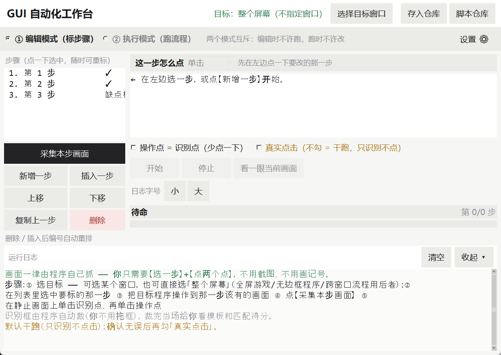
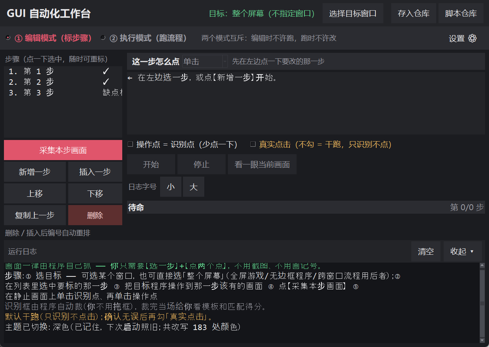

# GUI 自动化工作台

把"人手点几下界面"变成可靠自动流程的**两模窗口**：
编辑模式里标步骤 → 执行模式里跑流程。

浅色（默认）与深色两套主题，可在设置栏里随时切换：





---

## 零、下载即用（三条）

```bat
git clone https://github.com/YOZODO349/gui-auto-workbench.git
cd gui-auto-workbench
启动.bat
```

`启动.bat` 会**自己建虚拟环境、装依赖**（首次约 1–2 分钟，要联网），然后开窗。
不想用 git 就点仓库右上角 **Code → Download ZIP**，解压后双击 `启动.bat`。

**环境要求**：Windows + **Python 3.10 或更高**。
装 Python 时**务必勾上 `tcl/tk`**（有些精简版/绿色版没带 tkinter，双击后会闪退），
以及 `Add python.exe to PATH`。想先验一遍再开界面：双击 `自检.bat`，
或 `跑全部质量门.bat`（24 道门，含反向对照）。

---

## 一、怎么启动

**双击 `启动.bat`**（别去敲命令行）。

窗口打开后长这样 —— 顶上模式切换、左边步骤列表、右边详情 + 运行按钮、底下日志：

```
┌ GUI 自动化工作台 ─────────────────────────────────────────────────┐
│ ● ① 编辑模式（标步骤）  ② 执行模式（跑流程）  [选择目标窗口][存入仓库][脚本仓库] │
├───────────────────────┬─────────────────────────────────────────┤
│ 步骤（点一下选中…）     │ 这一步怎么点 [单击▾] 先在左边点一下要改的那一步  │
│ ┌───────────────────┐ │ ← 在左边选一步，或点【新增一步】开始。          │
│ │   （步骤列表）      │ │ □ 操作点 = 识别点   □ 真实点击（不勾 = 干跑）  │
│ └───────────────────┘ │ [ 开始 ] [ 停止 ] [ 看一眼当前画面 ]           │
│ [采集本步画面][新增一步] │ 日志字号  小  大                             │
│ [插入一步][上移][下移]  │ 待命                           第 0/0 步     │
│ [复制上一步][删除]      │ ─────────────────────────────────────────── │
├───────────────────────┴─────────────────────────────────────────┤
│ 运行日志                                            [清空] [收起] │
└─────────────────────────────────────────────────────────────────┘
```

> 上面这张就是**空白态**（还没选目标、一步都没标）。真样张见同目录 `界面预览.png`。

---

## 二、你要做的只有三件事

1. **选目标** —— 点右上角【选择目标窗口】：列表**第一行就是「★ 整个屏幕」**，
   下面是各个可见窗口。全屏游戏 / 无边框程序 / 跨窗口流程 → 直接用「整个屏幕」
2. **在左边列表里选中要标的那一步**（第一次标就点【新增一步】）
3. 把目标程序**自己操作到这一步该有的画面**，切回工作台，点【采集本步画面】：
   - 程序会自己：收起来 → 把目标窗口拉回前台 → 抓一帧 → 铺成全屏遮罩
   - 你在**静止的画面上点两下**：第一下点**识别点**，第二下点**操作点**
   - 点完当场给你看：坐标、自动裁出的模板小图、**当场匹配得分**

**你不用截图，也不用在图上画框画圈。** 画面一律由程序自己抓 —— 所以尺寸天然一致、
也不会有任何记号留下当噪点。这就是这套做法跟"交截图"最本质的区别。

> 标到一半想改某一步？列表里**直接选中它重标**就行，不用从头再来，也不用全标完才能跑。

---

## 二之二、两种目标模式，怎么挑

| 模式 | 什么时候用 | 代价 |
|---|---|---|
| **★ 整个屏幕**（不指定窗口） | 全屏游戏、无边框窗口、一个流程要跨好几个窗口 | 桌面上**别的窗口会被一起抓进去** —— 跑之前把画面收拾干净；屏幕分辨率变了要重标 |
| **某个窗口**（按标题精确匹配） | 普通窗口程序 | 窗口移动、缩放都还能跟上（按客户区算） |

**全屏模式为什么更省事**：帧内坐标**就是**屏幕坐标，不做任何偏移换算，
也不用管"把目标窗口拉回前台"那套麻烦事（它只需要工作台自己先让开）。

**注意**：列表里的"桌面窗口"（Progman / WorkerW）是被**主动过滤**掉的 ——
那是防你误把「桌面」当成一个目标程序。它跟"整个屏幕"不是一回事：
桌面壳窗口的客户区由 Explorer 托管、随时被别的窗口盖住，抓出来往往是壁纸或空白。
要全屏就用「★ 整个屏幕」。

---

## 三、五个词，认一下就够

| 词 | 意思 |
|---|---|
| **识别点** | 这一步**最独特、最静止**的那个元素（一个标题、一个图标、一个按钮）——框由程序自动裁，你只给一个点 |
| **操作点** | 这一步**要点哪里**。跟识别点同一个位置的，勾上"操作点 = 识别点"少点一下 |
| **操作类型** | 这一点**是单击还是双击**。取点时在复核弹窗里选，事后也能在左侧下拉里随时改；**默认单击**，老数据不用动 |
| **参考分辨率** | 程序从第一张采集帧自己量的，你不用管；坐标存的是相对值，换机器也能用 |
| **干跑** | 只识别、不点击（**默认**） |
| **真实点击** | 勾上才会真的动鼠标 |

---

## 四、怎么开真实点击（按这个顺序，别跳）

1. 先点【看一眼当前画面】—— 它会逐步骤打印识别得分和读法，确认每一步都认得出
2. **先干跑一遍**（不勾"真实点击"）：确认流程判断没问题
3. 都没问题了，才勾上【真实点击】，把目标程序停在起始画面上，点【开始】

---

## 五、出错了去哪看现场

- 界面上会显示那一刻的截图路径，就在 `logs\` 下的 `fail_*.png`，**你可以直接把这张图发回来**
- 日志区可滚动、字号可调（【日志字大】【日志字小】）
- 跑完一定会给一句明确结论：**完成 ✓** 还是 **中止 ✗ + 原因**，不会静默结束

---

## 六、命令行分层验（排查问题用）

用**项目自带的解释器**跑，别用系统默认的：

```bat
.venv\Scripts\python.exe runner.py --list-windows   :: 枚举窗口，认目标窗口标题
.venv\Scripts\python.exe runner.py --check          :: 验配置与数据是否齐备
.venv\Scripts\python.exe runner.py --list           :: 列出所有步骤
.venv\Scripts\python.exe runner.py --probe          :: 抓一帧，逐步骤报置信度（最该先跑）
.venv\Scripts\python.exe runner.py --dry            :: 干跑
.venv\Scripts\python.exe runner.py --live           :: 真实点击
.venv\Scripts\python.exe runner.py --selftest       :: 跑全套自测（73 项，含反向对照）
```

**给外部程序用的 `--json`**：任一命令后加 `--json` 即输出机器可读 JSON，
且**退出码与文本模式完全一致**（可据此判断成败）：

```bat
.venv\Scripts\python.exe runner.py --check --json   :: {target, reference, steps[...], ready, reason}
.venv\Scripts\python.exe runner.py --probe --json   :: {frame_wh, scale, steps[...], best}
.venv\Scripts\python.exe runner.py --dry   --json   :: 终态 payload + events[] 全程事件流
```

> 不带 `--json` 时输出**一字未改**（老脚本、人眼照旧）；两种模式互不干扰。

**置信度怎么读**（这是区分"画面不对"和"模板不对"最快的办法）：

| 得分 | 含义 |
|---|---|
| < 0.35 | 画面根本不是目标页（在闪屏/加载/弹窗上）—— 这是**正确行为**，去修起跑门控，别改阈值 |
| 0.75 ~ 0.82 | 画面对了，但模板脏了或阈值偏高 |
| ≥ 0.90 | 正常命中 |

---

## 六之二、识别层扩展点（怎么接 OCR / 特征点匹配）

识别分派已做成**可注册表**，内建 `template`（模板匹配）与 `tone`（色调匹配）两种。
新增一种方法**不用改分派逻辑**，只要两行：

```python
# 1) 新建 src/matcher_ocr.py
from src.matcher import MatchResult, register

def _match_ocr(frame, tmpl, roi, scales, threshold, tone_spec, want_debug):
    ...                                  # 你的实现
    return MatchResult(ok=True, score=0.93, method="ocr", box=(x, y, w, h))

# 2) 注册
register("ocr", _match_ocr)
```

注册后 `match_one(..., method="ocr")` 即可生效；`src/picker.py` 与 `src/engine.py`
**无需任何改动**（它们只调 `match_one`）。

**契约**：处理器必须收统一 7 参 `(frame, tmpl, roi, scales, threshold, tone_spec, want_debug)`，
返回 `MatchResult`。`MatchResult` 是**统一契约，不可改**。

**为什么暂不实现 OCR**：PaddleOCR / Tesseract 会引入重依赖（torch / onnxruntime + 数百 MB 模型），
与"本地优先、轻部署"冲突。**先留接口**，等真有"文字会变、版面固定"的场景再落地。

---

## 七、做不到什么（**比"能做到什么"更重要**）

- **登录、验证码、活动弹窗、把程序开到某一页** —— 这些只有人能干，程序只等不点
- **界面大改版**之后识别点会失效，需要重新标
- 只有**明确允许自动化**的环境里才用系统级点击

---

## 七之二、脚本仓库（存储区 + 编辑区，**全程不用写代码**）

主窗右上角点【**脚本仓库**】打开（任何模式下都可用，与执行流程无关）。
窗口分**左右两区**：左边是"仓库里有什么"，右边是"选中这条的内容"。

### 两条路：存进去 / 取出来

| 方向 | 入口 | 做什么 |
|---|---|---|
| **工作台 → 仓库** | 主窗右上角【**存入仓库**】 | 把工作台**当前标好的步骤**收成一条新脚本 |
| **仓库 → 工作台** | 仓库窗里【**载入到工作台**】 | 把某条脚本的步骤取回台面去跑（会先问一句） |

**【存入仓库】怎么用**（在主窗标完步骤之后）：

1. 点右上角【存入仓库】→ 给这条脚本起个名字 → 点【存进仓库】
2. 存进去的是**工作台里已经标齐的那几步**；帧与模板会**复制一份**到这条脚本名下，
   **工作台这边原样不动**（两边各一份，谁也覆盖不到谁）
3. **没标齐的步骤不会被收**：程序先把缺什么逐个点名，你确认了才只收标齐的那几部分；
   一步都没标齐 / 一步都没有 → **直接拦住**，不会给你造一条空脚本
4. 参考分辨率、匹配阈值、点击半径**一起存进这条脚本**（换台机器载入才不会裁错框）

存完点【脚本仓库】就能在列表里看到它；之后用【载入到工作台】取回来跑。

> ⚠ **工作台是草稿台，仓库才是资产库**：`profile.json` 是你"正在编的那几步"，
> `scripts.json` 是你"攒下来的脚本"。清掉工作台不动仓库，反之亦然。

### 左：存储区

- **列表**按表格对齐显示：名称 / 更新时间 / 简介（没写简介就显示"共 N 步"）
- **搜索**按名称实时筛（只搜名称）；**排序**支持最近更新 / 最早更新 / 最近创建 / 按名称
- **新建 / 删除 / 重新读盘**三个按钮；点任意一条即**选中**

### 右：编辑区（选中即加载）

- 选中某条 → 名称、简介、时间戳、步骤列表**自动填进右栏**，不用点"编辑"
- **步骤列表**里点一步 → 下方显示这一步的详情（只读），可**新增 / 插入 / 上移 / 下移 / 删除本步**
- **操作类型**（单击 / 双击）点一下即改即存
- 每步的画面**照主窗那套点选流程采**：【采集本步画面】→ 程序抓帧 → 在静止帧上点一下 → 复核 → 回写。
  和主窗工作台**完全同一套交互**，不出现任何让你手打代码的框
- 改完点【**保存修改**】→ **回写到原来那一条**（条数不变，不是另存新文件）
- 【**另存为新脚本**】= 复制一份（步骤 id 重编号 + 帧/模板素材一并复制），原稿不动
- 【**载入到工作台**】把这条脚本的步骤搬进主窗工作台（会先问一句，且**不动仓库数据**）

⚠ **改了没点保存就换选中 / 关窗** → 会自动替你带上（静默落盘），不会丢。

### 数据长什么样

一条脚本 = **步骤列表**，不是一坨文本：

```json
{ "id": "sc01", "name": "每日签到", "desc": "", "updated": "...",
  "steps": [ { "id": "sc01-01", "type": "click", "rel": {"x":0.31,"y":0.62}, ... } ],
  "cfg":   { "reference": {"w":1600,"h":900}, "match": {...}, "execution": {...} } }
```

- **步骤 id 带脚本前缀**（`sc01-01`）：帧和模板按步骤 id 命名，两条脚本都从 `s01` 起会**互相覆盖素材**，带前缀天然隔离
- **每份脚本自带 `cfg`**：参考分辨率、匹配阈值、点击半径都跟着脚本走 ——
  写进 `profile.json` 就是污染别人的工作台配置，不写则换台机器裁错框

⚠ **仓库与工作台是两份独立数据**：`scripts.json` 是你的脚本资产，
`profile.json` 是当前正在编辑的步骤配置 —— 互不影响，清掉工作台不动仓库。

---

## 八、目录里都是些什么

```
启动.bat              双击它开窗口
gui.py                两模窗口（界面全在这）
runner.py             命令行分层验（含 --json 机器可读输出）
config/profile.json   配置表（**换目标程序只改这一张**；`window.target` = `window`/`screen`）
config/scripts.json   脚本仓库（攒下来的自动化脚本，独立于 profile）
data/frames/          每一步程序采集到的帧（裁模板、做互斥比对的底稿）
assets/templates/     识别点裁出来的模板
logs/                 出错现场截图；crash.txt 是界面异常黑匣子
src/winio.py          窗口 / 截图 / 输入注入
src/matcher.py        识别层（模板匹配 + 色调匹配，**可注册表**，可扩展 OCR）
src/engine.py         状态机（三道闸门 / 恢复熔断 / 收尾校验）
src/picker.py         以点裁框 → 裁模板 → 生成数据（界面与自测共用）
src/host.py           宿主抽象（真机 / 离线两套，离线用于自测）
src/safeui.py         异常黑匣子（回调异常落盘 + 标红）
src/scripts_repo.py   脚本仓库持久化层（读写 / 搜索 / 排序 / 步骤增删改 / 另存为）
src/tokens.py         界面令牌层（颜色 / 字体 / 间距的唯一真源）
src/geometry.py       坐标换算 + 三源旁证
tools/selftest.py     自测 73 项，关键路径全带反向对照 + evals 量化指标
tools/verify_crash.py    异常黑匣子验证（含反向对照）
tools/verify_cli_json.py --json 输出验证（含反向对照）
tools/verify_smallwin.py 小窗布局验证 148 项（含滚动条复判反向对照）
tools/verify_stepops.py  步骤增删改 + 执行互斥闸门验证
tools/verify_script_repo.py 脚本仓库验证 121 项 + 11 项反向对照（含双区界面契约 + 按钮不被压扁）
tools/verify_all.py   一键跑全部 18 道质量门（正向 + 反向对照）
tools/probe_close_btn.py   量底部按钮的实宽 vs 所需宽（专治"被挤得很小"）
tools/shot_repo.py    脚本仓库窗口实拍（人工核对布局）
tools/make_fixtures.py   造无记号假界面（自测夹具）
交接提示词_给新Agent复刻用.md  在**新电脑**上从零复刻本工作台的施工指令（正文 4000 字，含空格）
```

---

## 九、这套东西的可靠性是怎么保证的

**每条关键路径都配一条「反向对照」** —— 一条"故意注入病因、它必然失败"的对照。
不这么做，你测到的很可能是**假通过**（代码碰巧对了，而不是逻辑对了）。

| 验证脚本 | 项数 | 覆盖 |
|---|---|---|
| `tools/selftest.py` | **73** | 坐标换算 / 三向互斥 / 缩放 / 抗背景变化 / 色调四重证据 / 状态机整链 / 门控 / 识别层注册表 / 三源旁证 |
| `tools/verify_smallwin.py` | **148** | 极窄窗口下 25 个关键控件全部可见 / 状态文字截断 / **目标名按剩余空间截断** / 日志折叠 / **滚动条延迟复判** |
| `tools/verify_crash.py` | 13 | 回调异常落盘 + 标红 + 窗口不崩 |
| `tools/verify_cli_json.py` | 13 | `--json` 可解析 + 字段齐 + 退出码一致 + 默认输出不可解析 |
| `tools/verify_stepops.py` | — | 增 / 插 / 删 / 移 + 编号重排 + **执行互斥闸门**（连点只生效一次） |
| `tools/verify_script_repo.py` | **121 + 11** | 脚本仓库全链：持久化往返 / 重启读取 / 搜索 / 排序 / 增删改 / 另存为 / **工作台存入仓库**（步骤重编 id + 素材复制 + 台面只读）/ **双区界面契约**（编辑区无可编辑代码框、选中即加载、保存回写原 id、载入工作台后 profile 按字节还原）/ **填表对话框按内容自适应尺寸** / **四档窗口下按钮不被压扁、【关闭】满宽在窗内** |

**四条反向对照都真的证伪过**：

- 不带 `--json` → 输出**不可**被 `json.loads` 解析
- 注册一个恒不匹配的假识别方法 → `match_one` **确实**分派到它（证明真在查表）
- 客户区偏移故意写错 20px → 三源旁证**判不一致**
- 摘掉滚动条复判调度 → 灌满一屏滚动条**不出现**
- 把仓库塞进 `profile.json` → 工作台配置**确实被污染**（证明分开存是必需的）；
  搜索写死"不过滤" / 简介不兜底正文 / 更新无脑刷时间 → 对应正向断言**全部变红**
- `steps_of` 返回**副本** → 采集 / 增删改动写进空气（"改了没生效"）
- 另存为**不重编步骤 id** → 两条脚本共用素材名，帧与模板**互相覆盖**
- 存入仓库**不重编步骤 id** → 仓库那条与工作台草稿指向同一个素材文件名（改一个动两个）
- 存入仓库**不复制素材** → 台面与仓库共用同一张帧，覆盖一个即坏另一个
- 填表对话框**尺寸写死 540×280** → 主按钮被挤出窗底（"完整可见"那条断言立刻变红）

跑法：`runner.py --selftest`，或直接 `tools/` 下逐个跑。

